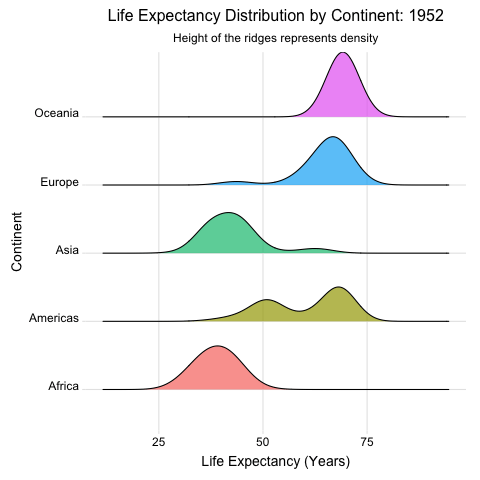
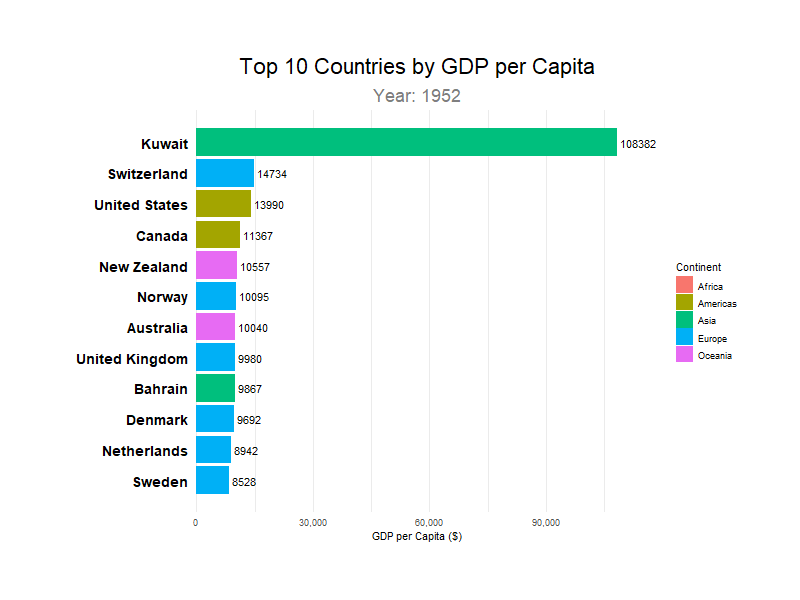

# Gapminder Data Visualization

Animated visualizations exploring global development trends using the [Gapminder](https://www.gapminder.org/) dataset.

Advanced Visualization in R course project

## Quick Start

```bash
Rscript analysis.R
```

This generates 4 animated GIF files in the project directory.

```bash
Rscript analysis_part2.R
```

This generates 4 additional animated GIF files (bar chart race variants, incl. Poland).

## Requirements

The script auto-installs missing packages. Required:
- `gapminder` - dataset
- `ggplot2`, `dplyr` - data manipulation & plotting
- `gganimate`, `gifski` - animation rendering
- `ggridges` - ridgeline plots
- `scales` - axis label formatting (e.g., comma separators)

## Generated Visualizations

### Visualization 1: Hans Rosling Bubble Chart


**What it shows:** The relationship between wealth (GDP per capita) and health (life expectancy) across countries from 1952-2007.

**Key insights:**
- **Wealth-health correlation**: Higher GDP consistently associates with longer life expectancy
- **Continental patterns**: European and Oceanian countries cluster in the upper-right (rich & healthy), while African nations dominate the lower-left
- **The "Asian miracle"**: Watch Asian countries (particularly China and South Korea) dramatically shift rightward over time
- **Poland highlighted**: Tracked with a black ring to highlight poland's development trajectory

**Design elements:**
- Bubble size = population
- Log scale on x-axis to spread out lower-income countries
- Smooth animation reveals temporal trends

---

### Visualization 2: Population-Weighted Ridgeline Density Plot



**What it shows:** The distribution of life expectancy within each continent, **weighted by population**, animated over time.

**Key insights:**
- **Population-weighted**: Unlike a simple country count, this shows where *people* live — China and India heavily influence Asia's distribution
- **Africa's spread**: Large population centers at varying life expectancies create a wide distribution
- **Europe's tight peak**: Uniformly high life expectancy across similarly-sized populations
- **Asia dominated by giants**: Watch how China and India's improvements shift the entire Asian ridge rightward
- **Global convergence**: All continents shift rightward over time, representing genuine improvement in human welfare

**Design elements:**
- Ridge height = population density at that life expectancy
- Larger countries have proportionally more influence
- Color-coded by continent for quick identification

---

### Visualization 3: Bar Chart Race (GDP per Capita)



**What it shows:** The top-ranked countries by GDP per capita over time, animated as a bar chart race.

**Key insights:**
- **Leaders shift over time:** Watch how small wealthy nations and resource-driven economies trade places at the top
- **Continental patterns:** Europe and Oceania frequently dominate the highest ranks, with notable entries from the Americas and Asia
- **Growth stories:** Rapid climbers illustrate economic transformations and convergence among high performers

**Design elements:**
- Interpolated values every 0.2 years for smooth motion
- Bars sized by GDP per capita; color-coded by continent
- Top 12 countries displayed per frame with value labels
- Fixed x-axis via view-follow for stable readability

**Variants:**
- **Slower (`visualization3_slower.gif`)**: 1000 frames at 10 fps (≈100s). Smoother motion for detailed observation of rank changes.
- **Faster (`visualization3_faster.gif`)**: 500 frames at 20 fps (≈25s). Quicker pacing for rapid overviews.
- **Poland (Slower) (`visualization3_Poland_slower.gif`)**: Same timing as slower, with Poland always shown (pinned below Top 10 if outside).
- **Poland (Faster) (`visualization3_Poland_faster.gif`)**: Same timing as faster, with Poland pinned.

## Output Files

| File                        | Dimensions     | Description                     |
| --------------------------- | -------------- | ------------------------------- |
| `visualization1.gif`        | Standard       | Rosling bubble chart            |
| `visualization1_wide.gif`   | 800×450 (16:9) | Rosling chart for widescreen    |
| `visualization2.gif`        | Standard       | Ridgeline density plot          |
| `visualization2_wide.gif`   | 800×450 (16:9) | Ridgeline for widescreen        |
| `visualization3_slower.gif` | Standard       | Bar chart race (GDP per capita) |
| `visualization3_faster.gif` | Standard       | Bar chart race (GDP per capita) |
| `visualization3_Poland_slower.gif` | Standard       | Bar chart race with Poland pinned |
| `visualization3_Poland_faster.gif` | Standard       | Bar chart race with Poland pinned |

## Data Source

The `gapminder` package contains an excerpt of data from [Gapminder.org](https://www.gapminder.org/), covering 142 countries across 5 continents from 1952 to 2007 (every 5 years).

Variables: `country`, `continent`, `year`, `lifeExp`, `pop`, `gdpPercap`

## Authors

- Paula Banach, 440186
- Igor Kołodziej, 440239
